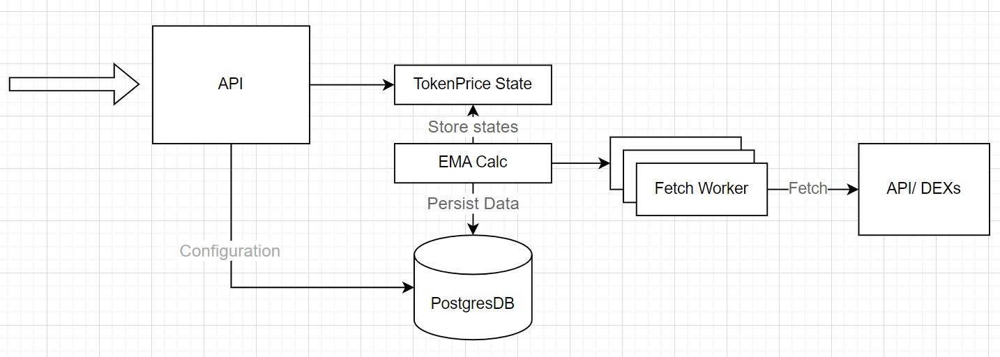

# Token Price Fetcher

## Overview
A token price fetcher that provide calculated data through a simple api server. This application allow to fetch some token's price (configurable), and EMA metric in multiple time resolution, and send warning to the user's discord threads when a specific (configurable) condition is met.
### Features
* [x] Configure specific token list to monitor
* [x] Configure trigger conditions to warn users, and send warning to discord through webhook api
* [x] API return the current token price, and it's calculated EMA metrics involve EMA-7 and EMA-20 in 1 minute, 1 hour, 4 hours, 1 day resolutions.
* [x] Realtime data flow from fetching token price, calculating EMA metrics and persisting to database. Since the api persist historical price values in database, it can load data from database after restart from crashes, instead of waiting for getting enough data to calculate EMA metrics.
* [x] Fetch token price from coingecko api, can easily expand to involve more source thanks to good interface design.
### Missing features
* [ ] Validate user configuration
* [ ] Deal with discord webhook api rate limit
* [ ] Get list of user's configured running token
* [ ] Support multiple users
* [ ] Use factory pattern to create token price source on demand ( configurable)
## Design decision
### How it works?
To keep it simple and get the best performance of calling api (100rps as requirement), I design a pipeline including 3 step: 
1. Fetch token price from source, store it to database every 1 minute.
2. Foreach fetched price values, I send it to a list of buckets of multiple time resolutions, including 1 minute, 1 hour, 4 hours, 1 day. If a token price at that time fall into the next bucket, I will calculate the EMA metric of that token price in given resolution.
3. All last calculated EMA metrics and last fetched price are store in memory as state of that token price. API call will receive data only from memory. If a token state change (because there are new EMAs was calculated), I will find all user that subcribed to that token, examine all conditions and send warning to discord if there are any conditions is met.

When restart after crashes, to reconstruct a token state, I query the last 20 price values each resolution, sort ascending by time, then add all value to buckets as in step 2. It's an lightweight and fast way to recovery from crashes.

All of this flow is done with goroutines and channels.
### Architecture
This application only include 2 parts (to keep it simple), an api and a postgresql database. I mostly use data in memory so no need any external caching services.

The diagram


This code is following the Clean code architecture inspired by Uncle Bob (https://blog.cleancoder.com/uncle-bob/2012/08/13/the-clean-architecture.html). I separate the code in 4 domain layers:

* entity layer
* usecase layer
* inteface and adapter
  * api controller
  * repo and external service
* app (bootstrap)

By using this architecture, I can easily plug-n-play any external token price source in my app with minium effort.
### Scalable & Benchmark
The application is single process. Because number of tokens is limited, we can easily scale more threads to run fetching price tasks when we get more tokens subcribed using only one process. This design is good at api calling, because all data values are store in memory, but if we get more and more users, we need to scale this application to multiple processes, also to keep it high availability. If I had more time, I would try another architecture using a TSDB that have responsibility to store price value data and downsample into multiple resolution, and a producer-consumer pipeline to schedule fetch price tasks.

__This is benchmark__

Concurrent: 100
```
21:36:07 INFO: Request label stats:
+------------------------------------------------+--------+---------+--------+-------+
| label                                          | status |    succ | avg_rt | error |
+------------------------------------------------+--------+---------+--------+-------+
| http://localhost:8080/prices/v1/token/bitcoin  |   OK   | 100.00% |  0.004 |       |
| http://localhost:8080/prices/v1/token/ethereum |   OK   | 100.00% |  0.007 |       |
+------------------------------------------------+--------+---------+--------+-------+
```

Follow this instruction to run benchmark
```
# install https://github.com/Blazemeter/taurus
pip install bzt

# run benchmark
bzt test.benchmark.yml
```

## Development

- Setup dependencies

```shell
docker-compose -f docker-compose.development.yaml up -d
```

- Install & run
```shell
# install
go mod tidy
make install

# run
make start

# gen swagger docs
make swag

# test
make test
```

- Access the swagger docs at [http://localhost:8080/swagger/index.html]. Example configuration payload

```json
{
  "condition": [
    "DIPS_1M_EMA_7"
  ],
  "discord_webhook": "https://discord.com/api/webhooks/...",
  "send_notify": true,
  "tokens": [
    "ethereum", "bitcoin", "cardano"
  ]
}
```

## Deloyment

```shell
docker-compose -f docker-compose.yaml up -d
```
